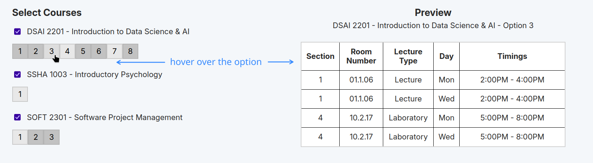
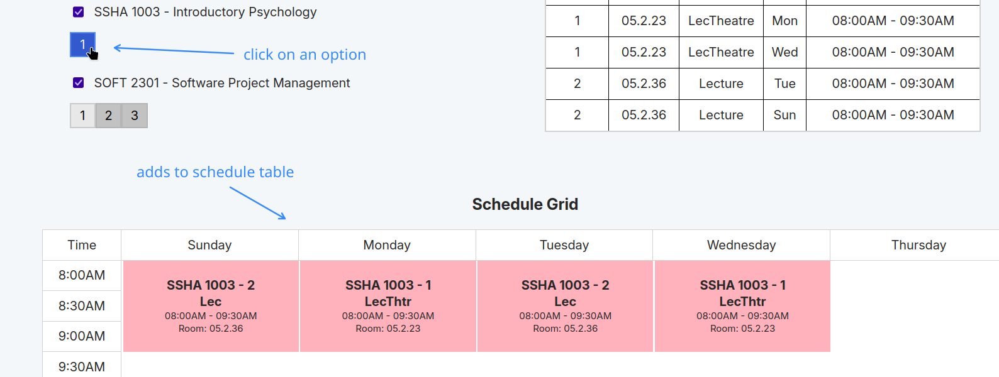
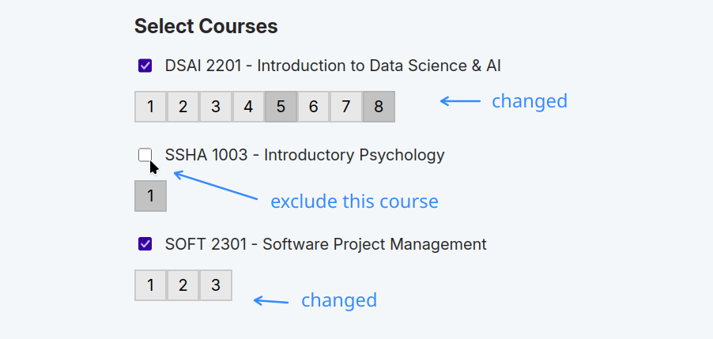

# scheduler-udst-revamp

Schedule calculator and visualizer for UDST classes during enrollment with PeopleSoft. Improvized version of previous iteration (`scheduler-udst`), now exclusively in a web interface.

Works in **PC ONLY** currently.

## How to run the app

- Prerequisites: `npm`.

- Install packages
```bash
npm install
```

- Build and run
```bash
npm run build && npm start
```

- For development purposes (with live preview)
```bash
npm run dev
```

## How to use the app

**FULL VIDEO DEMO COMING SOON** (whenever enrollment period for next sem starts)


- In PeopleSoft, go to the Enrollment page for classes (Manage Classes > Enrol).
- Then, select the class that you want to put in the schedule using "Select Class" button (Or go to the course in **Course Catalog**).
- Copy the entire page.
- Paste the text into the *text input box* on the website.

<!--  -->


#### Demo Video with Course Catalog
https://github.com/user-attachments/assets/d5592a0f-f8fe-47dc-aaab-63456935a131


- For adding more classes, repeat the above steps and append to the text (add to the bottom of what you pasted):

```
DSAI 2201
Introduction to Data Science & AI
Course Information
Class Selection
...

SOFT 2301
Software Project Management
Course Information
Class Selection
...
```

 - Hover over the *option buttons* to preview the sections, room numbers, timings of that option. An **option** refers to the course's option you see in PeopleSoft "Course Information" page.
 

 - Select an option by clicking on it. This will add it to the schedule and will also *filter out* conflicting options in other courses.
 

 - Exclude a course by unchecking the checkbox. This will calculate schedules without considering that course (like if it wasn't entered at all).
 

 - Play around with the selections to visualize schedules.
