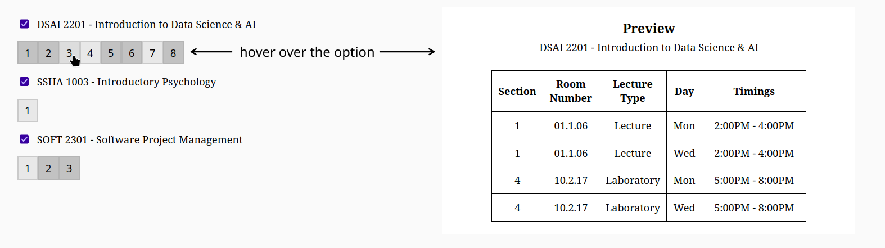
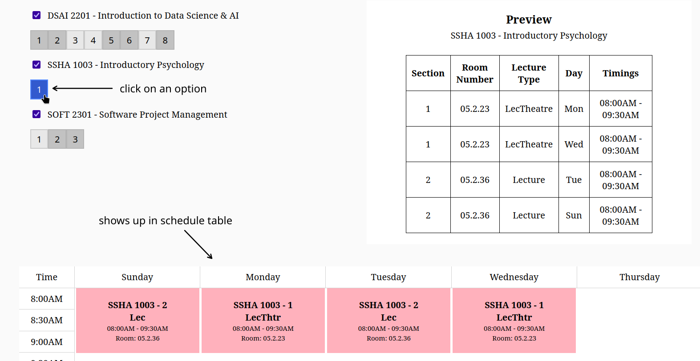
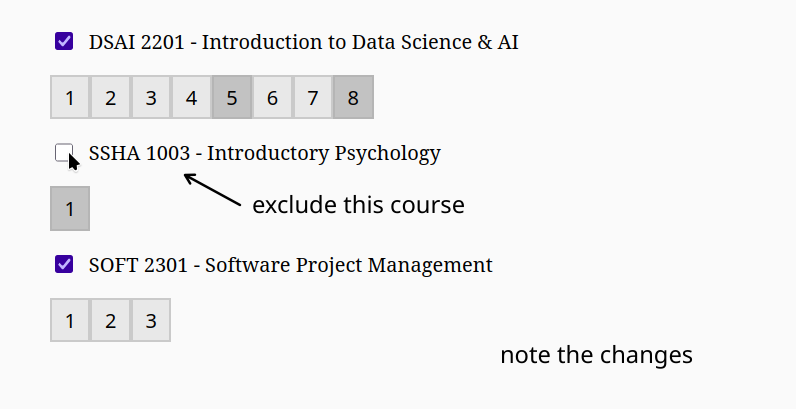

# scheduler-udst-redux

Schedule calculator and visualizer for UDST classes during enrollment with PeopleSoft. Improvized version of previous iteration (`scheduler-udst`), now exclusively in a web interface.

## How to run the app

- Prerequisites: `npm`.

- Install packages
```bash
npm install
```

- Build and run
```bash
npm run build && npm start
```

- For development purposes (with live preview)
```bash
npm run dev
```

## How to use the app

**VIDEO DEMO COMING SOON** (whenever enrollment period for next sem starts)


- In PeopleSoft, go to the Enrollment page for classes (Manage Classes > Enrol).
- Then, select the class that you want to put in the schedule using "Select Class" button.
- Copy the entire page (Ctrl + A, Ctrl + C).
- Paste the text into the *text input box* on the website. Will look something like:


```
DSAI 2201
Introduction to Data Science & AI
Course Information
Class Selection
Select a class option
8 options
Option

Status

Session

Class

Meeting Dates

Days and Times

Room

Instructor

Seats

1

Open

Regular Academic Session

Lecture - Class 1950 -Section 1
Laboratory - Class 1951 -Section 2

04/05/2025 - 26/06/2025

Monday
2:00PM to 4:00PM
Wednesday
2:00PM to 4:00PM
Tuesday
8:00AM to 11:00AM
Sunday
8:00AM to 11:00AM

01.1.0601.1.06
10.2.1710.2.17

Mohamed Salah Amine BenouarMohamed Salah Amine Benouar
Mohamed Salah Amine BenouarMohamed Salah Amine Benouar
...

```
- For adding more classes, repeat the above steps and append to the text (add to the bottom of what you pasted):

```
DSAI 2201
Introduction to Data Science & AI
Course Information
Class Selection
...

SOFT 2301
Software Project Management
Course Information
Class Selection
...
```

 - Hover over the *option buttons* to preview the sections, room numbers, timings of that option. An **option** refers to the course's option you see in PeopleSoft course information page.
 

 - Select an option by clicking on it. This will add it to the schedule and will also *filter out* conflicting options in other courses.
 

 - Exclude a course by unchecking the checkbox. This will calculate schedules without considering that course (like if it wasn't entered at all).
 

 - Play around with the selections to visualize schedules.
